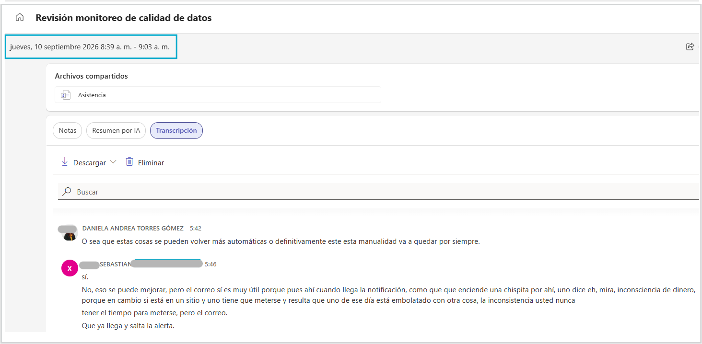
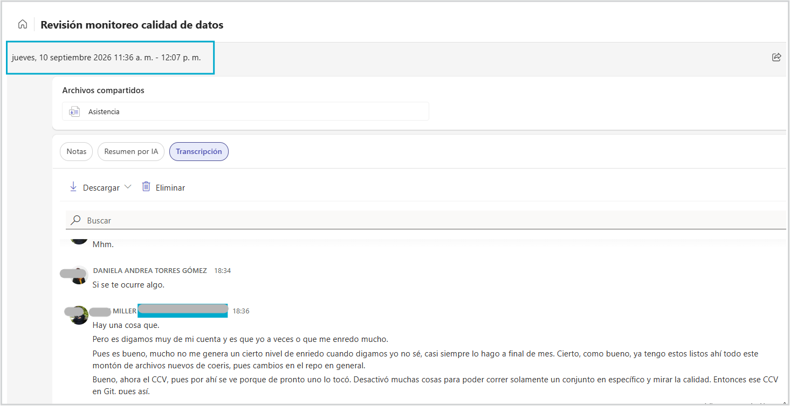

 

<h1>
Interacción Humano-Computador
</h1>
<h2>
Introducción a la Interacción Humano-Computador
</h2>
<h3>
Entregable #2 Empatia
</h3>

 

**Elaborado por:** _Milena Castaño_ & _Daniela Torres_ & _Sebastian Sanchez_ & _Kevin Hidalgo_

**Correos:** _lmcastanoh@unal.edu.co_ & _datorresgom@unal.edu.co_ & _sebsanchezar@unal.edu.co_ &
_kfhidalgoh@unal.edu.co_

**Grupo:** 5

**Fecha de elaboración:** _2026 Septiembre 07_

**Fecha última modificación:** _2026 Septiembre 07_

---

<h2>
Tabla de contenido
</h2>

- [1. Claridad del objetivo](#1-claridad-del-objetivo)
- [2. Descripción del perfil de usuario](#2-descripción-del-perfil-de-usuario)
- [3. Metodología utilizada](#3-metodología-utilizada)
- [4. Análisis y síntesis de la información](#4-análisis-y-síntesis-de-la-información)
- [5. Hallazgos clave (Insights)](#5-hallazgos-clave-insights)
- [6. Implicaciones para el diseño](#6-implicaciones-para-el-diseño)
- [7. Evidencias y documentación](#7-evidencias-y-documentación)
- [8. Conclusión y reflexión](#8-conclusión-y-reflexión)
- [Referencias](#referencias)

---

## 1. Claridad del objetivo

- **Propósito del proceso de empatía y contexto general del proyecto:**

  > El proceso de empatía se realizó con el propósito de comprender las necesidades, dificultades,
  > comportamientos y expectativas de los administradores y analistas encargados de la operación de
  > SIMEM, particularmente en las actividades relacionadas con el monitoreo de la calidad,
  > disponibilidad y actualización de los datos publicados en la plataforma.
  >
  > Actualmente, la información asociada al estado de los datos y a las validaciones de calidad se
  > encuentra distribuida en múltiples mecanismos independientes: correos electrónicos, archivos
  > CSV, consultas manuales a las bases de datos de SIMEM, monitor de carga de datos diario y una
  > alerta de conjuntos de datos con publicaciones definidas en plazos regulatorios[^1]. Esta
  > situación genera una experiencia fragmentada que dificulta la identificación temprana de
  > incidentes, el seguimiento de problemas y la priorización de acciones correctivas.
  >
  > A través de este estudio se busca comprender: Cómo identifican actualmente los usuarios los
  > problemas de calidad de datos. Qué información necesitan para investigar y resolver un
  > incidente de calidad. Cuáles son las principales dificultades para monitorear la integridad,
  > completitud y oportunidad de los datos publicados. Qué factores generan retrasos en la
  > detección y resolución de problemas. Cómo debería ser una herramienta centralizada que facilite
  > la supervisión operativa y reduzca la dependencia de procesos manuales.
  >
  > El objetivo final es generar los insumos necesarios para diseñar una aplicación web con enfoque
  > centrado en el usuario, que permita consolidar métricas, alertas, hallazgos e indicadores de
  > calidad de datos en un único punto de consulta, facilitando una gestión más proactiva,
  > eficiente que permita un análisis más concreto y la toma ráida de decisiones frente a los
  > incidentes de calidad, antes de que estos impacten a los consumidores de información de SIMEM.
  > Además, busca reducir la carga operativa que conlleva la atención de requerimientos por parte
  > de los usuarios finales

  <!-- > [@espinosa_empatizar_2026]. -->

---

## 2. Descripción del perfil de usuario

- **Caracterización general:**

  > Los usuarios involucrados en la operación y monitoreo de SIMEM son profesionales entre 25 y 45
  > años, con formación universitaria o de posgrado en áreas como ingeniería eléctrica, ingeniería
  > física, ingeniería de sistemas, ciencia de datos o disciplinas afines.
  >
  > Sus principales objetivos son:
  >
  > 1. Garantizar la disponibilidad y confiabilidad de los datos publicados.
  > 2. Detectar oportunamente errores e inconsistencias.
  > 3. Investigar causas raíz de incidentes.
  > 4. Realizar seguimiento al estado de las cargas de información.
  > 5. Atención de requerimientos de los usuarios finales.
  > 6. Cumplir con los tiempos regulatorios y operativos establecidos para la publicación de
  >    información, entre otros.

- **Segmentación de usuarios:**

  > - **Soporte SIMEM**: Personal con conocimiento técnico avanzado sobre la infraestructura,
  >   cargas de datos, procesos de integración, API's y componentes tecnológicos de la plataforma.
  > - **Analista SIMEM Experto**: Usuarios con amplio conocimiento de las reglas de negocio, la
  >   operación del Mercado de Energía Mayorista y los diferentes conjuntos de datos publicados en
  >   SIMEM.
  > - **Analista SIMEM Novato**: Personal recientemente vinculado al equipo o con experiencia
  >   limitada en la plataforma, que participa en actividades operativas específicas y requiere un
  >   proceso rápido de aprendizaje. Debido a la rotación frecuente de este rol, los usuarios
  >   suelen depender de documentación, acompañamiento y procesos manuales para comprender el
  >   funcionamiento del sistema.

- **Personas o Arquetipos:**

  > A partir de la segmentación y los patrones identificados en el proceso de empatía, se
  > construyeron los siguientes arquetipos enfocados en las dimensiones cognitivas y emocionales de
  > los usuarios frente al monitoreo de SIMEM:
  >
  > **Arquetipo 1: El Analista Experto (Ej. Camilo, 38 años)**
  >
  > - **Contexto:** Ingeniero con amplio conocimiento de las reglas de negocio del Mercado de
  >   Energía Mayorista y la arquitectura de los conjuntos de datos en SIMEM. Lidera la
  >   investigación de incidentes complejos.
  > - **Metas:** Garantizar la total confiabilidad de los datos publicados, cumplir estrictamente
  >   con los plazos regulatorios y resolver incidentes antes de que impacten a los consumidores
  >   finales.
  > - **Frustraciones:** Lidiar con información fragmentada distribuida en correos electrónicos,
  >   archivos CSV y alertas independientes. Siente que la falta de una herramienta centralizada le
  >   hace perder tiempo valioso en tareas operativas manuales.
  > - **Emociones predominantes:** Estrés ante la presión de los plazos regulatorios, frustración
  >   por la carga operativa que requiere cruzar datos manualmente, pero orgullo y satisfacción
  >   cuando logra identificar la causa raíz de un problema complejo.
  > - **Comportamientos:** Revisa múltiples pantallas y fuentes de información de forma simultánea,
  >   realiza consultas manuales a las bases de datos para validar discrepancias y prioriza la
  >   revisión del monitor de carga a primera hora del día.
  >
  > **Arquetipo 2: El Analista Novato / Soporte Operativo (Ej. Manuela, 26 años)**
  >
  > - **Contexto:** Recién vinculada al equipo de operaciones. Al pertenecer a un rol con rotación
  >   frecuente, se encuentra en una curva de aprendizaje acelerada respecto a la infraestructura y
  >   componentes tecnológicos de la plataforma.
  > - **Metas:** Comprender rápidamente el flujo de los datos, realizar el seguimiento diario al
  >   estado de las cargas y atender de manera eficaz los requerimientos y tickets de los usuarios
  >   finales.
  > - **Frustraciones:** Depender excesivamente de la documentación existente o del acompañamiento
  >   de los analistas expertos. Se confunde fácilmente al tener que revisar múltiples mecanismos
  >   independientes de alerta.
  > - **Emociones predominantes:** Inseguridad al tomar decisiones sobre la integridad de un dato,
  >   sensación de estar abrumada por la arquitectura fragmentada del sistema y alivio cuando logra
  >   validar correctamente una carga.
  > - **Comportamientos:** Consulta constantemente los manuales, pregunta con frecuencia a sus
  >   compañeros de mayor experiencia para confirmar si una alerta es real o un falso positivo, y
  >   revisa de manera cautelosa y secuencial antes de dar respuesta a un requerimiento de un usuario.

---

## 3. Metodología utilizada

- **Técnicas empleadas:**

  > **Entrevistas cualitativas y actitudinales**: Se acudió directamente al usuario para recoger
  > relatos, emociones, comportamientos y contextos, buscando comprender el porqué y el cómo de sus
  > acciones. Se utilizaron preguntas abiertas para fomentar la elaboración de respuestas y evitar
  > sesgos. En el guion figuraban las siguientes preguntas núcleo:
  >
  > - Cuéntame sobre la última vez que tuviste que investigar un incidente complejo de calidad de
  >   datos en SIMEM. ¿Cómo fue el proceso paso a paso?
  > - ¿Cómo te sientes o qué pasa por tu mente cuando la información para resolver un incidente de calidad está
  >   fragmentada en múltiples correos, alertas en el administrador y archivos de csv?
  > - Si la plataforma centralizada fuera perfecta y nunca se te pasara por alto un error de
  >   datos, ¿cómo cambiaría tu día a día y tu nivel de estrés? (Aplicando la técnica de
  >   storytelling inverso).
  > - ¿Cómo resuelves un error de calidad de datos que llega por el correo electrónico? (muestra paso a paso)
  > - ¿Cómo configuras una nueva variable en la herramienta de calidad de datos? (muestra paso a paso)
  > - ¿Qué te gustaría que tuviera una herramienta de calidad de datos centralizada?
  > - ¿Qué herramientas, aplicaciones o pantallas tienes que abrir y consultar simultáneamente para poder cruzar esa información y entender qué falló?
  > - ¿En qué momento exacto de tu jornada sientes que el cansancio mental o la fatiga visual empiezan a pasar factura?
  > - Si pudieras eliminar una sola tarea manual, repetitiva o de 'apagado de incendios' de tu rutina diaria de validación, ¿cuál elegirías y por qué?
  > - Cuando necesitas corregir un dato, ¿cómo es el proceso de interacción con el equipo de soporte y cuánto tiempo suele tardar ese ciclo de retroalimentación?
  >
  > **Mapeo de Afinidad**: Se utilizó para agrupar las observaciones clave de las entrevistas en
  > temas y patrones consistentes.
  >
  > **Mapas de Empatía y Creación de Personas:** Técnicas de síntesis empleadas para traducir la
  > información dispersa en un retrato emocional que refleja lo que el usuario dice, piensa, hace y
  > siente. Se utilizó la herramienta de Figma para este ejercicio.

- **Proceso de aplicación:**
  > El proceso se estructuró siguiendo las buenas prácticas de la investigación cualitativa
  > (directa), dividido en las siguientes fases:
  >
  > - **Participantes y Contexto:** Se seleccionó una muestra cualitativa de 3 participantes que
  >   representan fielmente al público objetivo: Analistas Expertos, Analistas Novatos y personal
  >   de Soporte SIMEM. El equipo actualmente se conforma de 4 personas en total. Las sesiones se llevaron a cabo entre el 2026-09-08 y el 2026-09-10, en una llamada por Teams 
  >   de manera individual.
  > - **Ejecución:** Cada entrevista tuvo una duración aproximada de 30 minutos. Se inició
  >   explicando claramente el propósito del estudio y se solicitó el consentimiento informado para
  >   transcibir la sesión, garantizando la confidencialidad y el anonimato de los datos. El
  >   facilitador utilizó un guion estructurado, pero flexible, prestando especial atención al
  >   silencio y a las preguntas de seguimiento (indagando con "¿por qué?") para descubrir
  >   fricciones no declaradas superficialmente.
  > - **Herramientas y Síntesis:** Se emplearon herramientas de transcripción para capturar con precisión las citas literales de los usuarios. Durante y
  >   después de las sesiones, se tomaron notas durante las entrevistas en una
  >   pizarra digital [Figma](https://www.figma.com/board/pQEPSOq8GjVXWQMWtwcZKo/02_entrega?node-id=0-1&t=zNVi0B00uq4236BK-1).
  >   Esta organización de datos permitió construir posteriormente
  >   los arquetipos empáticos presentados en la sección anterior.

- **Justificación metodológica:**
  > La entrevista actitudinal fue seleccionada como método principal debido a que el objetivo fue
  > entender cómo los usuarios experimentan actualmente la gestión de incidentes de calidad dentro
  > de SIMEM. Esta técnica permitió profundizar en aspectos como:
  >
  > Frustraciones durante la búsqueda de información. Dificultades para identificar incidentes
  > críticos y priorizarlos. Necesidades de seguimiento y trazabilidad. Percepciones sobre la
  > efectividad de las herramientas actuales de monitoreo. Expectativas frente a una plataforma
  > centralizada de gestión de calidad de datos.
  >
  > La elección de una metodología también estuvo motivada por las características del equipo de
  > trabajo: un grupo reducido de analistas con amplio conocimiento del proceso. Además, la
  > existencia de una herramienta preliminar de calidad permitió enfocar las conversaciones en la
  > experiencia de uso actual.

---

## 4. Análisis y síntesis de la información

- **Procesamiento de datos:**
  > Para transformar el volumen de datos recopilados en las entrevistas y observaciones en
  > información procesable, se aplicó la técnica de Mapeo de Afinidad. El proceso se estructuró en
  > tres fases metodológicas:
  >
  > 1. **Extracción de observaciones:** Cada intervención y respuesta clave de las entrevistas se
  >    desglosó en notas individuales que contenían hechos, citas literales y comportamientos
  >    observados.
  > 2. **Agrupación temática:** Las notas fueron agrupadas de manera colaborativa buscando
  >    similitudes conceptuales y relacionales, permitiendo aislar temas recurrentes sobre la
  >    operación diaria de SIMEM (tales como fuentes de información, fricciones técnicas, tiempos
  >    de respuesta y dependencia de procesos manuales)
  > 3. **Formulación de declaraciones ("Declaraciones Yo"):** A partir de cada categoría
  >    consolidada, se redactaron premisas en primera persona que reflejan la perspectiva vivencial
  >    de los analistas, sirviendo como puente directo para la construcción de los arquetipos y la
  >    definición de requerimientos

- **Identificación de patrones:**
  > Del análisis sintético de la información emergieron tres patrones y ejes temáticos principales
  > que describen la realidad operativa del monitoreo en SIMEM:
  >
  > - **Fragmentación y sobrecarga cognitiva:** Se identificó como un patrón constante que los
  >   analistas deben alternar entre múltiples canales desconectados (correos, reportes en CSV,
  >   consultas SQL directas y alertas aisladas). Esto genera un esfuerzo cognitivo elevado y un
  >   riesgo latente de pasar por alto incidentes críticos en los plazos establecidos.
  > - **Reactividad frente a proactividad:** Debido a la ausencia de una vista centralizada, la
  >   detección de errores de calidad de datos suele ser reactiva (impulsada por reportes de los
  >   usuarios finales o por la inminencia de un vencimiento regulatorio), limitando la capacidad
  >   de anticipación del equipo.
  > - **Brecha de conocimiento y dependencia de soporte:** Los analistas novatos experimentan una
  >   curva de aprendizaje pronunciada y demandan un alto acompañamiento por parte del personal
  >   experto, debido a que el conocimiento crítico del negocio y de las reglas de validación se
  >   encuentra disperso o no está centralizado en herramientas intuitivas.

- **Representaciones visuales:**

  > Como parte de la síntesis gráfica y conceptual del estudio, se desarrollaron los siguientes
  > artefactos de visualización:
  >
  > - **Mapas de Empatía:** Construidos para contrastar lo que los analistas dicen que hacen frente
  >   a lo que realmente piensan, hacen y sienten (por ejemplo, la dualidad entre la calma aparente
  >   en los reportes diarios y la ansiedad oculta ante la auditoría de los plazos regulatorios).
  >   <a href="./diagramaFlujoExcavacionValleReyes.html" target="_blank">Haga clic aquí para abrir
  >   el mapa de empatía</a>
  > - **Mapa del Viaje del Usuario (Journey Map - Monitoreo de Datos):** Trazó cronológicamente la
  >   experiencia del analista desde el inicio de su jornada (revisión de alertas matutinas) hasta
  >   la resolución de un incidente, evidenciando los "picos de frustración" asociados a la
  >   búsqueda manual de información y los "valles de alivio" al momento de certificar una carga
  >   exitosa. <a href="./diagramaFlujoExcavacionValleReyes.html" target="_blank">Haga clic aquí
  >   para abrir el mapa de viaje del usuario</a>

---

## 5. Hallazgos clave (Insights)

- **Descubrimientos principales:**
  - [Enumera los insights obtenidos a partir del análisis.]
  > [Escribe tu respuesta aquí...]
- **Relación con los objetivos:**
  - [Explica cómo estos hallazgos aportan a la comprensión de la experiencia del usuario y se
    alinean al proyecto.]
  > [Escribe tu respuesta aquí...]
- **Puntos fuertes y de mejora:**
  - [Destaca aspectos positivos actuales frente a las dificultades detectadas.]
  > [Escribe tu respuesta aquí...]

---

## 6. Implicaciones para el diseño

- **Criterios y recomendaciones:**
  - [Traduce los hallazgos en requisitos de usabilidad, criterios de diseño o recomendaciones
    concretas.]
  > [Escribe tu respuesta aquí...]
- **Orientación para futuras fases:**
  - [Explica cómo esta información guiará la definición del problema, ideación, prototipado o
    pruebas.]
  > [Escribe tu respuesta aquí...]

---

## 7. Evidencias y documentación

##### Mapa de empatía y diagrama de afinidad
- Disponible en [Figma](https://www.figma.com/board/pQEPSOq8GjVXWQMWtwcZKo/02_entrega?node-id=0-1&t=zNVi0B00uq4236BK-1).

##### Capturas de entrevistas

**Figura 1.** Evidencias de las sesiones de entrevista realizadas con usuarios del proceso.

#### Fragmentos relevantes de las entrevistas

A continuación, se presentan algunas respuestas representativas recopiladas durante las entrevistas realizadas a los usuarios del proceso.

  ### 👤 Entrevistado 1:

  >**¿Cómo te sientes o qué pasa por tu mente cuando la información para resolver un incidente de calidad está fragmentada en múltiples correos, alertas y archivos?**
  >" Considero que las herramientas actuales son útiles y me ayudan en el proceso de validación, pero todavía tienen algunas limitaciones. Me ha pasado que la herramienta genera alertas de inconsistencias que realmente no corresponden a problemas de calidad de datos. Esto suele ocurrir cuando se modifican consultas (queries) y esos cambios no se actualizan en la herramienta, cuando hay errores durante la configuración de nuevas variables o cuando quedan configuraciones desactualizadas que generan falsas alertas de forma recurrente.

  >"Para analizar los incidentes normalmente me apoyo tanto en los correos electrónicos como en la tabla de alertas. Desde mi perspectiva, ambas herramientas se complementan y me permiten tener una mejor visión de lo que está ocurriendo."

  ### 👤 Entrevistado 2:
  > **¿Qué te gustaría que tuviera una herramienta de calidad de datos centralizada?**

  > Me gustaría que la herramienta me permitiera diferenciar claramente entre los conjuntos que están atrasados y los conjuntos que realmente tienen errores de calidad. Para mí son problemas distintos: un conjunto atrasado no necesariamente tiene datos incorrectos, mientras que un error de calidad implica que existen diferencias frente a la fuente, datos nulos o información incompleta. Por eso, quisiera poder identificar rápidamente qué tipo de problema tiene cada conjunto.

  > También me gustaría poder visualizar los errores de calidad de forma inmediata, sin tener que revisar múltiples herramientas o fuentes de información. Idealmente, la herramienta debería mostrarme directamente cuál es el valor publicado en SIMEM y cuál es el valor que existe en la fuente, para entender rápidamente si la diferencia corresponde a un error, a un dato faltante o a una inconsistencia menor.

  > Sería muy útil poder consultar el estado de calidad para una fecha específica. Por ejemplo, hacer una búsqueda sobre un conjunto de datos para una fecha determinada y verificar fácilmente si la validación fue exitosa, si presentó errores o si esas inconsistencias ya fueron corregidas posteriormente.

  > Otro aspecto importante es tener visibilidad completa sobre las versiones de los datos. Me gustaría saber si todas las versiones esperadas fueron cargadas, identificar rápidamente versiones faltantes y responder preguntas como: "¿ayer se cargaron todas las versiones de este conjunto?" sin tener que hacer investigaciones manuales
  

  ### 👤 Entrevistado 3:
  > **¿Si pudieras eliminar una sola tarea manual, repetitiva o de "apagado de incendios" de tu rutina diaria de validación, cuál elegirías y por qué?**

  > Inicialmente no se me ocurre una única tarea específica que eliminaría, pero sí hay varias actividades que considero muy manuales y que podrían automatizarse para facilitar el trabajo diario.

  > Una de ellas es la configuración de nuevos conjuntos o variables. Actualmente debo registrar manualmente la información en archivos CSV, crear los archivos SQL necesarios para las validaciones y realizar varios ajustes de configuración. Son tareas repetitivas que consumen tiempo y que podrían hacerse de una forma más automatizada.

  > También me genera una carga importante trabajar con conjuntos multifuente. En esos casos termino con muchas ventanas y pestañas abiertas al mismo tiempo, revisando diferentes extracciones relacionadas entre sí. Cuando un conjunto tiene múltiples fuentes y cada una tiene varias extracciones hijas, el seguimiento se vuelve complejo y requiere mucha concentración para no perder el contexto de lo que estoy revisando.

  > Otro aspecto que me gustaría eliminar son las tareas asociadas a los recargues. Frecuentemente debo modificar temporalmente los deltas para ejecutar una recarga específica y después devolver esas configuraciones a su estado original. Como normalmente estoy trabajando en varios conjuntos al mismo tiempo, existe el riesgo de olvidar alguno de esos cambios. De hecho, me ha pasado que después de llegar a casa recuerdo que dejé una configuración modificada y debo volver a conectarme para corregirla, incluso en ocasiones durante la noche o los fines de semana que me acuerdo que la dejé mal configurada.

---

## 8. Conclusión y reflexión

- **Resumen de aprendizajes:**
  - [Sintetiza lo aprendido sobre los usuarios y su interacción con el sistema.]
  > [Escribe tu respuesta aquí...]
- **Limitaciones del proceso:**
  - [Reflexiona sobre posibles sesgos, tamaño de la muestra o limitaciones de las técnicas usadas.]
  > [Escribe tu respuesta aquí...]

## Referencias

<!-- \bibliography -->
<!-- [1]: A. E. Bedoya, «Empatizar». Presentación de clase, Interacción Humano Computador
(3009669), Universidad Nacional de Colombia, Facultad de Minas, Sede Medellín, 2026. -->

[^1]:
    Los conjuntos de datos regulatorios están definidos en la resolución CREG 101 018 del 2022, por
    la cual se crea el Sistema de Información del Mercado de Energía Mayorista, SIMEM. Estos tienen
    fechas exactas en las que se debe publicar la información. En caso contrario pueden existir
    sanciones por incumplimiento de la normatividad.
