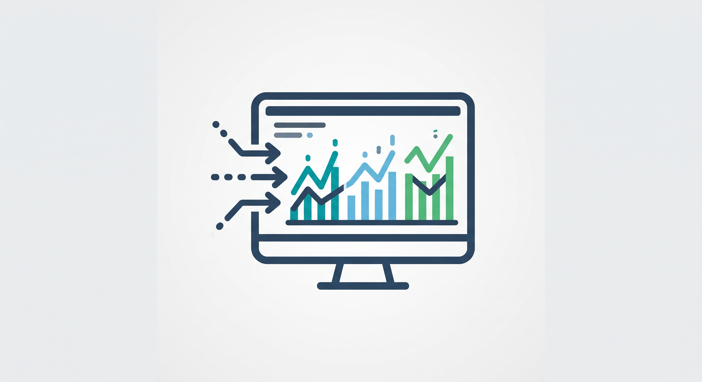
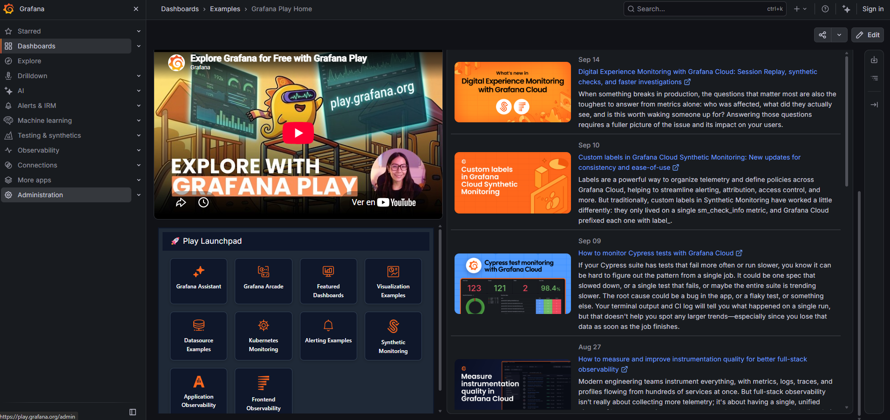
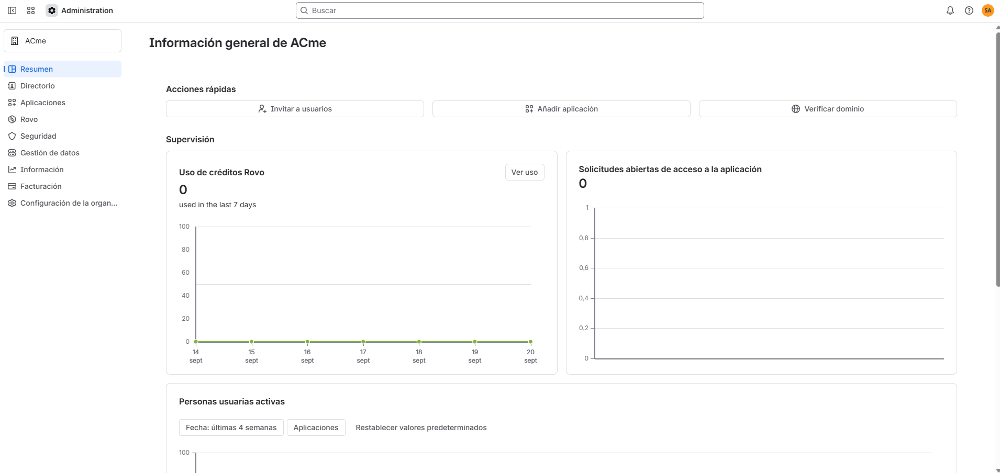
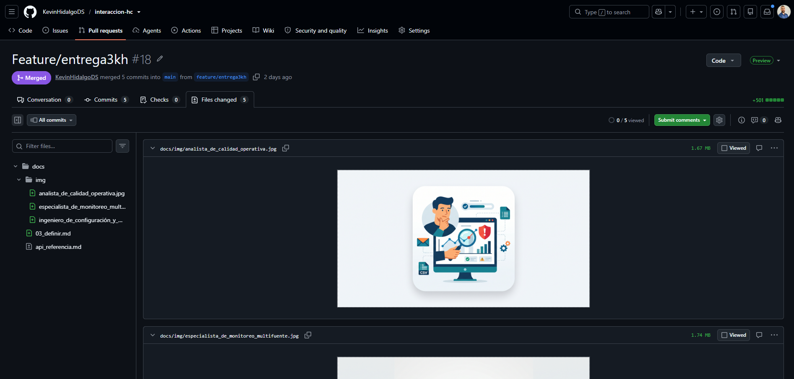

 

<h1>
Interacción Humano-Computador
</h1>
<h2>
Definiendo el problema
</h2>
<h3>
Entregable #3
</h3>

 

**Elaborado por:** _Milena Castaño_ & _Daniela Torres_ & _Sebastian Sanchez_ & _Kevin Hidalgo_

**Correos:** _lmcastanoh@unal.edu.co_ & _datorresgom@unal.edu.co_ & _sebsanchezar@unal.edu.co_ &
_kfhidalgoh@unal.edu.co_

**Grupo:** 5

**Fecha de elaboración:** _2026 Septiembre 14_

**Fecha última modificación:** _2026 Septiembre 20_

---

<h2>
Tabla de contenido
</h2>

- [1. Persona](#1-persona)
  - [1.1 Insumos previos](#11-insumos-previos)
  - [1.2 Nombre y foto](#12-nombre-y-foto)
  - [1.3 Panorama general](#13-panorama-general)
  - [1.4 Antecedentes y biografía](#14-antecedentes-y-biografía)
  - [1.5 Gustos y metas](#15-gustos-y-metas)
  - [1.6 Disgustos y frustraciones](#16-disgustos-y-frustraciones)
- [2. Mapa de experiencia del usuario](#2-mapa-de-experiencia-del-usuario)
- [2.1 Persona y antecedentes del recorrido](#21-persona-y-antecedentes-del-recorrido)
- [2.2 Fases](#22-fases)
- [2.3 Acciones, problemas y emociones por fase](#23-acciones-problemas-y-emociones-por-fase)
- [2.4 Pensamientos y sentimientos](#24-pensamientos-y-sentimientos)
- [2.5 Hallazgos y oportunidades (opcional)](#25-hallazgos-y-oportunidades-opcional)
- [3. Declaración del problema](#3-declaración-del-problema)
  - [3.1 Primer borrador (fórmula base)](#31-primer-borrador-fórmula-base)
  - [3.2 Iteraciones](#32-iteraciones)
  - [3.3 Declaración de posibilidades](#33-declaración-de-posibilidades)
- [4. Investigación competitiva](#4-investigación-competitiva)
  - [4.1 Definir el objetivo de la investigación](#41-definir-el-objetivo-de-la-investigación)
  - [4.2 Análisis de fortalezas, oportunidades, debilidades y amenazas (si aplica)](#42-análisis-de-fortalezas-oportunidades-debilidades-y-amenazas-si-aplica)
  - [4.3 Demostración relámpago (si aplica)](#43-demostración-relámpago-si-aplica)
  - [4.4 Análisis competitivo (si aplica)](#44-análisis-competitivo-si-aplica)
- [5. Consolidación del entregable — Paso Definir](#5-consolidación-del-entregable--paso-definir)
  - [5.1 Persona (resumen)](#51-persona-resumen)
  - [5.2 Mapa de experiencia del usuario (resumen)](#52-mapa-de-experiencia-del-usuario-resumen)
  - [5.3 Declaración del problema final](#53-declaración-del-problema-final)
  - [5.4 Declaración de posibilidades, final](#54-declaración-de-posibilidades-final)
  - [5.5 Hallazgos clave de la investigación competitiva](#55-hallazgos-clave-de-la-investigación-competitiva)

---

**Instrucciones generales** Esta plantilla guía al equipo a través de las cuatro actividades del
paso Definir del proceso de pensamiento de diseño, en el orden en que se desarrollan en el capítulo
de referencia:

- Persona
- Mapa de experiencia del usuario
- Declaración del problema y declaración de posibilidades
- Investigación competitiva

Completen cada sección con base en la investigación de usuarios ya realizada (entrevistas, mapa de
afinidad, declaraciones en primera persona). Al finalizar, la plantilla completa constituye el
entregable consolidado del paso Definir.

---

## 1. Persona

### 1.1 Insumos previos

- [x] Entrevistas de usuario realizadas
- [x] Mapa de afinidad elaborado
- [x] Declaraciones en primera persona generadas a partir del mapa de afinidad

### 1.2 Nombre y foto

- **Nombre de la persona:** El Analista de Calidad Operativa
- **Foto o ícono representativo (adjuntar o describir):** Foco en verificación diaria de alertas,
  correos y cruce de datos 

- **Nombre de la persona:** El Ingeniero de Configuración y Metadatos
- **Foto o ícono representativo (adjuntar o describir):** Foco en la gestión manual de archivos
  CSV, parámetros y ajustes de queries SQL
  

- **Nombre de la persona:** Especialista de Monitoreo Multifuente
- **Foto o ícono representativo (adjuntar o describir):** Foco en la supervisión de ejecuciones,
  Data Lakes, recargues y resolución de cuellos de botella
  

> _Nota: si el equipo considera que un nombre o foto reales pueden introducir sesgos de identidad
> (por ejemplo, de género), pueden optar por un nombre abstracto (por ejemplo, “el inversionista
> tecnológico”) y un ícono en lugar de una foto._

### 1.3 Panorama general

<!-- prettier-ignore -->
| Campo | Descripción |
| :--- | :--- |
| Profesión / ocupación | Ingeniero de Datos / Analista de Calidad de Datos |
| Edad | 28 años |
| Intereses / juegos / marcas afines | Intereses: Acampar los fines de semana, asistir a conciertos de música en vivo y festivales, pedir comida a domicilio en días de alta carga laboral. Juegos: Cult of the Lamb, Mario Kart. Marcas afines: Nintendo, Rappi, Domino's Pizza, Cine Colombia. |

<!-- prettier-ignore -->
| Campo | Descripción |
| :--- | :--- |
| Profesión / ocupación | Desarrollador Python / Arquitecto Cloud |
| Edad | 32 años |
| Intereses / juegos / marcas afines | Intereses: Motociclismo de aventura y planeación de rutas largas por el país, preparación de café de especialidad con métodos de filtrado, cocina con ingredientes vegetales. Juegos: Videojuegos independientes y simuladores. Marcas afines: Royal Enfield, Microsoft Azure, Victoria (hierro fundido), Supermercado Vaquita. |

<!-- prettier-ignore -->
| Campo | Descripción |
| :--- | :--- |
| Profesión / ocupación | Científico de Datos / Estudiante de Maestría en Analítica |
| Edad | 30 años |
| Intereses / juegos / marcas afines | Intereses: Senderismo por reservas naturales y cascadas, viajes a pueblos patrimonio, cuidado de plantas de interior y patios. Juegos: Juegos tipo MMO (Albion) y MOBA. Marcas afines: Samsung, Decathlon, Mercado Libre, Frutos & Semillas. |

### 1.4 Antecedentes y biografía

Redactar en 3-5 líneas la historia de la persona: pasatiempos, comportamientos regulares y cómo se
relacionan con el problema que se está explorando.

> - **Analista de Calidad Operativa:** Disfruta desconectarse acampando o asistiendo a conciertos,
>   pero en su día a día sufre de fatiga visual al tener que cruzar manualmente decenas de correos
>   con el administrador SIMEM. Su hábito de pedir comida a domicilio refleja su necesidad de
>   soluciones rápidas y convenientes, algo de lo que carece su flujo de trabajo actual, donde un
>   solo dato erróneo le consume toda la mañana. Busca alertas claras y centralizadas que le eviten
>   el desgaste repetitivo de buscar problemas dispersos y le dejen tiempo para tareas de mayor
>   valor.
> - **Ingeniero de Configuración y Metadatos:** Es un apasionado de las rutas largas en motocicleta
>   y la preparación metódica del café de especialidad, actividades que exigen precisión y
>   paciencia. En su trabajo, aplica esa misma meticulosidad para configurar manualmente variables
>   en archivos Excel/CSV y ajustar queries SQL, pero le frustra profundamente lo "artesanal" y
>   propenso a errores que es este proceso. El tener que "apagar incendios" por configuraciones
>   desactualizadas le roba energía que preferiría invertir en automatizar procesos y diseñar
>   arquitecturas más robustas.
> - **Especialista de Monitoreo Multifuente:** Acostumbrado a explorar extensos senderos en la
>   naturaleza y a coordinar estrategias complejas en juegos MMO, tiene gran capacidad para manejar
>   múltiples frentes a la vez. Sin embargo, en el trabajo, abrir simultáneamente el administrador
>   SIMEM, el Data Lake, Visual Studio Code y múltiples pestañas para monitorear recargues le
>   genera una sobrecarga cognitiva insostenible. Sueña con agentes inteligentes que sinteticen las
>   alertas por Teams, para que el miedo a olvidar una configuración temporal no le quite la
>   tranquilidad durante sus fines de semana.

### 1.5 Gustos y metas

Enumerar las metas de la persona, distinguiendo motivación interna (satisfacción personal) de
motivación externa (recompensas).

> **Analista de Calidad Operativa:**
>
> > - **Meta 1:** Centralizar la recepción y visualización de alertas en un solo lugar.
> >   - Motivación interna: Reducir la fatiga visual y el desgaste mental de saltar entre el correo
> >     electrónico, archivos CSV y el administrador SIMEM.
> >   - Motivación externa: Disminuir el tiempo de resolución de incidentes y evitar que una alerta
> >     crítica pase desapercibida por la saturación de correos.
> > - **Meta 2:** Identificar de un vistazo el origen exacto del fallo (SIMEM, Data Lake o fuente
> >   original).
> >   - Motivación interna: Sentir seguridad y control sobre el flujo de trabajo, eliminando la
> >     incertidumbre de no saber por dónde empezar a buscar.
> >   - Motivación externa: Reducir las horas de la mañana dedicadas al "apagado de incendios" y
> >     delegar el problema rápidamente al área responsable.
> > - **Meta 3:** Transicionar hacia un rol más estratégico y menos operativo.
> >   - Motivación interna: Satisfacción intelectual al dejar atrás tareas repetitivas y monótonas.
> >   - Motivación externa: Obtener reconocimiento por generar análisis de mayor valor para el
> >     negocio, dashboards e informes en lugar de solo auditar datos.

> **Ingeniero de Configuración y Metadatos:**
>
> > - **Meta 1:** Automatizar el registro y creación de nuevas variables de calidad.
> >   - Motivación interna: Sentir orgullo por mantener un proceso técnico limpio, estandarizado y
> >     libre del trabajo "artesanal".
> >   - Motivación externa: Reducir los errores humanos derivados de copiar, pegar y modificar
> >     filas en múltiples archivos de Excel y CSV.
> > - **Meta 2:** Eliminar las modificaciones manuales de consultas (queries) y configuraciones
> >   temporales.
> >   - Motivación interna: Tranquilidad al no depender de configuraciones "quemadas" o ajustes
> >     complejos que aumentan el riesgo de equivocarse.
> >   - Motivación externa: Disminuir la tasa de alertas falsas generadas en SIMEM causadas por
> >     queries desactualizados.
> > - **Meta 3:** Contar con visibilidad completa del historial de incidentes y métricas de
> >   calidad.
> >   - Motivación interna: Sentir respaldo y confianza en sus decisiones técnicas basadas en datos
> >     empíricos de evolución de inconsistencias.
> >   - Motivación externa: Demostrar con indicadores claros (porcentaje de calidad, tiempos de
> >     resolución) la mejora continua de la plataforma ante los directivos.

> **Especialista de Monitoreo Multifuente:**
>
> > - **Meta 1:** Consolidar el monitoreo de recargues y ejecuciones en una interfaz única.
> >   - Motivación interna: Reducir drásticamente la sobrecarga cognitiva generada por tener
> >     demasiadas pestañas, archivos y administradores abiertos simultáneamente.
> >   - Motivación externa: Prevenir fallas en la entrega de información, garantizando que no
> >     queden configuraciones temporales olvidadas tras un recargue.
> > - **Meta 2:** Implementar notificaciones inteligentes y resumidas (ej. vía Teams con agentes
> >   IA).
> >   - Motivación interna: Recuperar la capacidad de concentración al no ser interrumpido por
> >     decenas de correos electrónicos aislados que ya ni siquiera revisa completos.
> >   - Motivación externa: Agilizar la comunicación con el equipo de soporte mediante información
> >     sintetizada y lista para generar incidentes accionables.
> > - **Meta 3:** Reejecutar procesos fallidos automáticamente tras intermitencias de la fuente.
> >   - Motivación interna: Proteger su tiempo de descanso (noches y fines de semana) y evitar la
> >     ansiedad de dejar actividades pendientes.
> >   - Motivación externa: Mantener la continuidad y confiabilidad del Data Lake y SIMEM sin
> >     requerir intervención manual constante.

### 1.6 Disgustos y frustraciones

Enumerar qué obstaculiza a la persona, qué le resulta complicado o dónde falla actualmente su
experiencia.

> **Analista de Calidad Operativa:**
>
> > - **Frustración 1:** La información necesaria para resolver un solo incidente está severamente
> >   fragmentada; debe saltar constantemente entre correos, tablas de alertas, el administrador
> >   SIMEM, bases de datos y archivos Excel/CSV.
> > - **Frustración 2:** Perder gran parte de la mañana (de 8:00 a.m. a 11:00 a.m.) lidiando con
> >   tareas repetitivas y revisando falsas alertas provocadas por configuraciones desactualizadas
> >   o queries "quemados".
> > - **Frustración 3:** El proceso manual de investigación es tan demandante que un solo dato
> >   erróneo le consume horas de revisión, impidiéndole dedicar tiempo a tareas de mayor valor
> >   como la creación de informes y visualizaciones.

> **Ingeniero de Configuración y Metadatos:**
>
> > - **Frustración 1:** El proceso de agregar o modificar una variable es completamente
> >   "artesanal"; requiere copiar y pegar filas en un archivo CSV, buscar rutas en el FTP a mano y
> >   configurar parámetros uno a uno.
> > - **Frustración 2:** La necesidad de realizar ajustes manuales frecuentes directamente sobre
> >   los queries SQL (por ejemplo, en Oracle o para históricos), lo cual es complejo, rompe la
> >   estandarización y aumenta el riesgo de cometer errores.
> > - **Frustración 3:** Tener que manipular manualmente los archivos de configuración para
> >   desactivar temporalmente otras variables cuando necesita probar o validar únicamente una.

> **Especialista de Monitoreo Multifuente:**
>
> > - **Frustración 1:** La saturación excesiva de notificaciones por correo electrónico; el
> >   sistema envía tantos mensajes que resulta imposible revisarlos todos, lo que lo lleva a
> >   ignorarlos o leerlos solo de manera aleatoria.
> > - **Frustración 2:** El alto riesgo de error humano al realizar recargues manuales, ya que es
> >   muy fácil olvidar devolver las configuraciones temporales (como los deltas) a su estado
> >   original, obligándolo a conectarse en noches o fines de semana para corregirlo.
> > - **Frustración 3:** El severo agotamiento cognitivo y mental que le produce gestionar
> >   conjuntos de datos multifuente, pues lo obliga a mantener abiertas múltiples ventanas,
> >   pestañas y extracciones hijas simultáneamente sin perder el hilo de lo que está haciendo.

---

## 2. Mapa de experiencia del usuario

## 2.1 Persona y antecedentes del recorrido

- **Persona que protagoniza el recorrido:** Analista de Operación y Calidad de Datos del SIMEM
  (Perfil experto con alta competencia técnica pero sometido a procesos manuales fragmentados).
- **Cita o frase que resume por qué realiza este recorrido:** "Todo el día estoy enfocado/enfocada
  en la revisión de la calidad de datos y observando correos en lugar de analizar la información
  del mercado energético."

## 2.2 Fases

<!-- prettier-ignore -->
| Fase | Descripción |
| :--- | :--- |
| **1. Inicio de jornada** | Revisión inicial del estado general de las cargas y bandejas de entrada de correos electrónicos para detectar novedades o fallas críticas. |
| **2. Diagnóstico** | Acá se realiza la investigación a nivel detallado de inconsistencias mediante la apertura simultánea de múltiples herramientas, bases de datos y archivos de configuración. |
| **3. Ejecución** | Correcciones manuales debido a mala calidad de datos, backfills, coordinación de ajustes con los equipos de soporte o agentes. |
| **4. Cierre** | Verificación final del estado de los datos, archivo de incidencias y cierre de la jornada con alta fatiga operativa. |

## 2.3 Acciones, problemas y emociones por fase

<!-- prettier-ignore -->
| Fase | Acciones | Problemas encontrados | Satisfacción del usuario |
| :--- | :--- | :--- | :--- |
| **Inicio de jornada** | Revisar correo electrónico y monitor de ejecuciones. Identificar si falló alguna carga crítica o hay alertas regulatorias pendientes. | Alertas dispersas sin jerarquía. Saturación de correos electrónicos que dificulta la priorización de las actividades propias de los analistas. | Baja |
| **Diagnóstico** | Abrir bases de datos, scripts SQL y archivos CSV locales. Cruzar manualmente datos publicados en SIMEM con las fuentes originales. Investigar si el error es por retraso de la información o por datos corruptos. | Falsas alarmas recurrentes por consultas SQL desactualizadas. Fragmentación de la información en múltiples pantallas y pestañas. Alto desgaste cognitivo y fatiga visual. | Baja |
| **Ejecución** | Modificar manualmente parámetros de delta para realización de backfills de información. Editar archivos CSV de configuración y redactar sentencias SQL a mano. Reportar anomalías a soporte o agentes externos. | Procesos artesanales altamente propensos al error humano. Riesgo crítico de olvidar configuraciones temporales. | Baja |
| **Cierre** | Verificar el estado final de los conjuntos corregidos. Archivar correos y dar por terminada la revisión operativa diaria. | Falta de un historial centralizado de incidentes resueltos. Se encuentra con una sensación constante de gestión reactiva o apagado de incendios. | Media |

## 2.4 Pensamientos y sentimientos

<!-- prettier-ignore -->
| Fase | Hallazgo |
| :--- | :--- |
| **Inicio de jornada** | Me frustra que no a hora llegó el correo ni voy a abrir el csv... Me siento abrumada. |
| **Diagnóstico** | La información está regada en muchas partes; pierdo tiempo buscando y abriendo varias pestañas. |
| **Ejecución** | El cambio temporal de deltas y archivos de configuración me obliga a recordar que debo revertir configuraciones para que las próximas ejecuciones del proceso no presenten fallos. En ocasiones, me acuerdo de noche o en fines de semana que lo dejé mal. |
| **Cierre** | Quisiera un panel único donde las métricas, alertas e indicadores de calidad estén juntos sin tener que escribir código SQL para poder revisar. |

## 2.5 Hallazgos y oportunidades (opcional)

<!-- prettier-ignore -->
| Fase | Oportunidad |
| :--- | :--- |
| **Inicio de jornada** | Implementar un sistema de notificaciones inteligentes y priorizadas (con resúmenes ejecutivos automatizados) en lugar de saturar las bandejas de correo con alertas sueltas. |
| **Diagnóstico** | Desarrollar un panel centralizado (Torre de Control o dashboard) con una vista comparativa que cruce automáticamente SIMEM y fuentes de información, eliminando la navegación multifuente. |
| **Ejecución** | Automatizar la gestión de backfills mediante asistentes transaccionales que manejen los deltas de forma segura y reviertan cambios automáticamente, eliminando el error humano. |
| **Cierre** | Integrar un repositorio histórico y un sistema de trazabilidad de incidentes que permita auditar el comportamiento pasado sin depender de registros manuales no centralizados. |

## 3. Declaración del problema

### 3.1 Primer borrador (fórmula base)

> Como **administrador del SIMEM** necesito **monitorear** los errores de calidad de datos antes de
> que lleguen a los usuarios para poder **garantizar** la integridad de los datos según la ley de
> transparencia y del derecho de acceso a la información pública nacional.

### 3.2 Iteraciones

El capítulo señala que escribir una buena declaración del problema es un proceso repetitivo y
progresivo. Completar al menos tres iteraciones, aplicando en cada una un criterio de mejora.

- **Iteración 1 — Primer intento:** **Como** administrador del SIMEM, **quiero** garantizar la
  calidad de los datos que se publican en el sitio **para** dar tranquilidad a los usuarios finales
  de que el portal es confiable para la toma de decisiones.

- **Iteración 2 — Aplicando “ser específico”:** **Como** administrador del SIMEM **quiero**un
  monitor de datos del sitio **para prevenir requerimientos constantes y prevenir que se expongan
  datos incorrectos con los cuales los usuarios tomen decisiones, lo cual conlleva a una falta de
  confianza en la plataforma y un sobreesfuerzo en analizar manualmente los datos con múltiples
  herramientas.

  - _¿Es demasiado específica? ¿Ya incluye una solución dentro del problema? Justificar:_ Contiene
    en sí una posible solución al problema al mencionar el monitor de datos, sin embargo, está
    enfocada en el problema de negocio detrás.

- **Iteración 3 — Aplicando “dejar espacio para explorar” y “no asumir una solución”:** **Cómo**
  administrador del SIMEM, **quiero** garantizar la calidad y oportunidad de los datos que se
  exponen en el sitio, **para** prevenir que se tomen decisiones en base a datos incorrectos y
  prevenir el alto flujo de requerimientos de los clientes, lo cual se traduce en una falta de
  confianza en la plataforma y en un sobreesfuerzo en analizar manualmente los datos.

  - _Verificar: ¿la necesidad está expresada como verbo (necesidad real) o como sustantivo
    (solución encubierta)?_

- **Iteración final — Aplicando “escribir con empatía”**: **Como** administrador de SIMEM,
  **quiero** contar con una visión centralizada, clara y oportuna del estado de calidad de los
  datos y de los conjuntos con retrasos en su publicación, **para** detectar y gestionar incidentes
  de forma proactiva y así evitar requerimientos, reducir el tiempo invertido en investigaciones
  manuales, prevenir impactos sobre los usuarios y mantener la confianza en la información
  publicada.

### 3.3 Declaración de posibilidades

A partir de la declaración del problema final, redactar una o más preguntas que orienten la
ideación, con la forma “¿Cómo podríamos...?”.

- **Pregunta base:**

• ¿Cómo podríamos mostrar los errores cuando se presentan y que sean accionables, es decir, el cómo
solucionarlos?

• ¿Cómo podríamos mostrar qué versiones de la liquidación del mercado se han subido a la
plataforma?

• ¿Cómo podemos mostrar los indicadores de calidad del sitio?

• ¿Cómo podemos mostrar un seguimiento a los errores de calidad en el tiempo?

• ¿Cómo podemos reejecutar un conjunto atrasado? ¿Cómo hacerlo masivo?

• ¿Cómo podemos automatizar el registro de nuevas variables?

• ¿Cómo podemos revertir configuraciones de conjuntos de datos que olvidaron de reconfigurar?

• ¿Cómo facilitar el habilitar/deshabilitar conjuntos durante las pruebas de investigación
histórica?

• ¿Cómo mantener las alertas inmediatas (por correo) sin entrar a una plataforma?

• ¿Cómo evitar que queden queries desactualizados?

• ¿Cómo ayudar a saber si una persona ya está revisando una inconsistencia?

• ¿Cómo poder consultar el estado de calidad de una fecha específica para una variable?

• ¿Cómo separar los conjuntos atrasados de los que tienen errores de calidad y de los que tienen
errores por ejecución de la misma herramienta?

- **Variante 1 (usando el nombre de la persona en lugar de “usuarios”):**

• ¿Cómo podríamos ayudar al analista de Calidad Operativa a que vea los errores de calidad de forma
más accionable?

• ¿Cómo podríamos ayudar al analista de Calidad Operativa a que encuentre qué versiones de la
liquidación del mercado están cargadas y cuáles faltan?

• ¿Cómo podríamos ayudar al analista de Calidad Operativa a ver el seguimiento de los indicadores
de calidad en el tiempo?

• ¿Cómo podríamos ayudar a ingeniero de Configuración y Metadatos a automatizar el registro de
nuevas variables?

• ¿Cómo podríamos ayudar al analista de Calidad Operativa a saber si un problema de calidad ya fue
resuelto o alguien lo está atendiendo?

• ¿Cómo podríamos ayudar al analista de Calidad Operativa a actualizar masivamente los conjuntos
atrasados?

• ¿Cómo podríamos ayudar al analista de Calidad Operativa a realizar calidad histórica sin que
interfiera con la ejecución diaria?

• ¿Cómo podríamos ayudar al ingeniero de Configuración y Metadatos a que no queden queries
desactualizados o conjuntos con configuraciones atrasadas?

- **Variante 2 (explorando otro ángulo del mismo problema):** ¿Cómo podríamos **[ ]**?

• ¿Cómo podríamos ayudar a los administradores de SIMEM a identificar rápidamente qué conjuntos
presentan errores de calidad o retrasos en la publicación?

• ¿Cómo podríamos reducir el tiempo y esfuerzo necesario para investigar y resolver incidentes de
calidad de datos?

• ¿Cómo podríamos centralizar la información necesaria para analizar un incidente sin depender de
múltiples herramientas y fuentes?

• ¿Cómo podríamos proporcionar alertas claras y accionables que permitan actuar antes de que los
usuarios detecten los problemas?

• ¿Cómo podríamos mejorar la visibilidad y trazabilidad de los incidentes para evitar esfuerzos
duplicados y facilitar su seguimiento?

---

## 4. Investigación competitiva

### 4.1 Definir el objetivo de la investigación

- **Objetivo de la investigación competitiva:** Identificar cómo las plataformas de calidad y
  observabilidad de datos resuelven la centralización del estado de los conjuntos, la gestión de
  alertas, la configuración de reglas de validación y el seguimiento de incidentes, con el fin de
  reconocer buenas prácticas, vacíos y oportunidades de diferenciación para un centro de control de
  calidad de datos de SIMEM. Los criterios de comparación se derivan directamente de las
  frustraciones de las tres personas definidas en la sección 1.6.

- **Técnica(s) seleccionada(s):**
  - [x] Análisis de fortalezas, oportunidades, debilidades y amenazas
  - [x] Demostración relámpago
  - [x] Análisis competitivo

> _Justificación: el FODA se aplica a la herramienta actual de validación (desarrollada en Python)
> frente al mercado; la demostración relámpago busca inspiración para la fase de ideación; y el
> análisis competitivo audita, con criterios homogéneos, qué tan bien cubren las soluciones
> existentes las necesidades de nuestras personas._

### 4.2 Análisis de fortalezas, oportunidades, debilidades y amenazas (si aplica)

El análisis se realiza sobre la **herramienta actual de validación de calidad de SIMEM** (script en
Python, configurado mediante archivos `.CSV` y con notificaciones por correo), comparándola con las
soluciones identificadas en el mercado.

<!-- prettier-ignore -->
| | Factores internos | Factores externos |
| :--- | :--- | :--- |
| **Positivos** | **Fortalezas:** (1) Ya existe un motor que compara la fuente contra el Data Lake, tanto posterior a la carga como a demanda para históricos. (2) Se dispone de metadatos ricos por conjunto: periodicidad, clasificación, última fecha de actualización, fecha indexada máxima y próxima ejecución programada. (3) Equipo con alto dominio del Mercado de Energía Mayorista y de la estructura de los datos. (4) Conocimiento de necesidades propias del dominio (versiones de liquidación TX1/TX2, plazos regulatorios CREG) que las herramientas genéricas no contemplan. | **Oportunidades:** (1) La organización ya trabaja sobre el ecosistema Microsoft (Azure, Teams), lo que facilita notificaciones resumidas por Teams y el uso de agentes de IA. (2) Existen herramientas de código abierto (Great Expectations, Soda Core) cuyos patrones pueden reutilizarse sin costo de licencia. (3) Las dimensiones estándar de calidad (completitud, consistencia, oportunidad, exactitud) permiten construir indicadores comparables. (4) Reducir los requerimientos que hoy llegan por el CRM al detectar errores antes que el usuario final. |
| **Negativos** | **Debilidades:** (1) Las alertas llegan solo por correo, sin agrupación ni priorización, lo que genera saturación. (2) La configuración de variables es manual (filas en CSV, archivos SQL, parámetros uno a uno). (3) No existe historial consolidado ni indicadores de calidad en el tiempo. (4) No distingue un conjunto **atrasado** de uno **con errores de calidad** ni de un **error de configuración** (falsas alertas). (5) Los recargues requieren modificar deltas a mano y recordar revertirlos. | **Amenazas:** (1) Plataformas comerciales maduras (Monte Carlo, Microsoft Purview) pueden percibirse como alternativa "lista para usar", aunque con costo de licencia y menor ajuste al dominio. (2) Sanciones por incumplimiento de los plazos de publicación definidos por la CREG. (3) Rotación del rol de analista novato, que depende de conocimiento tácito no documentado. (4) Complejidad técnica de los conjuntos multifuente y de las fuentes heterogéneas (Oracle, FTP, Excel, APIs). |

**Ideas de producto derivadas del análisis:**

- **Idea 1 — Torre de control con tres estados diferenciados:** aprovechar los metadatos ya
  existentes para mostrar, en una sola vista, si un conjunto está _atrasado_, si tiene _errores de
  calidad_ o si la alerta proviene de un _error de configuración_ de la herramienta, con
  indicadores tipo semáforo.
- **Idea 2 — Asistente de configuración y recargues seguros:** un formulario guiado para dar de
  alta variables que genere la configuración y el SQL, permita una prueba en seco de una sola
  variable y revierta automáticamente los deltas temporales al terminar un recargue.
- **Idea 3 — Resumen inteligente por Teams:** reemplazar los correos individuales por un resumen
  diario agrupado por conjunto y severidad, con enlace directo al detalle de cada incidente.

### 4.3 Demostración relámpago (si aplica)

Reunir entre 8 y 10 ejemplos de productos: competidores directos, productos relacionados y
productos inspiradores sin relación directa.

> **Nota sobre la evidencia visual.** Las plataformas comerciales incluidas (Monte Carlo, Soda,
> Microsoft Purview, Azure Data Factory y PagerDuty) exigen cuenta corporativa, licencia o un
> despliegue propio, por lo que no fue posible capturar sus interfaces en un entorno productivo. En
> esos casos la evidencia es la **documentación oficial del fabricante**, que contiene las capturas
> de la función descrita y permite verificar la afirmación de forma independiente. En los ejemplos
> de acceso libre se adjunta captura propia. Todas las fuentes fueron consultadas el **20 de
> septiembre de 2026**.

<!-- prettier-ignore -->
| # | Producto o ejemplo | Tipo (competidor/relacionado/inspirador) | Evidencia (captura propia o fuente oficial) | ¿Qué inspira de este ejemplo? |
| :--- | :--- | :--- | :--- | :--- |
| 1 | Monte Carlo — vista de incidentes | Competidor | Documentación oficial: <https://docs.getmontecarlo.com/docs/incident-management> | Agrupar varias alertas relacionadas en un solo incidente y mostrar su impacto aguas abajo; aplicable para indicar si el fallo se originó en la fuente, el Data Lake o SIMEM. |
| 2 | Soda Cloud — creación de _checks_ | Competidor | Documentación oficial: <https://docs.soda.io/soda-documentation/soda-v3/use-case-guides/quick-start-end-user> | Reglas de validación declarativas y legibles, creadas desde la interfaz; inspira un asistente para dar de alta variables sin editar CSV. |
| 3 | Great Expectations — _Data Docs_ | Competidor | Documentación oficial: <https://docs.greatexpectations.io/docs/0.18/reference/learn/terms/data_docs/> | Reporte de cada validación con el valor esperado frente al observado; inspira la vista de detalle "valor en la fuente vs. valor publicado en SIMEM". |
| 4 | Microsoft Purview — Data Quality | Competidor | Documentación oficial: <https://learn.microsoft.com/purview/unified-catalog-data-quality> | Puntaje de calidad por activo y por dimensión; inspira el indicador de porcentaje de calidad global y por conjunto de datos. |
| 5 | Azure Data Factory — monitor de ejecuciones | Relacionado | Documentación oficial: <https://learn.microsoft.com/azure/data-factory/monitor-visually> | Listado de ejecuciones con su estado y opción de reejecutar; inspira el relanzamiento masivo de conjuntos atrasados. |
| 6 | Grafana — paneles y reglas de alerta | Relacionado |  <https://play.grafana.org> | Series de tiempo y silenciamiento de alertas conocidas; inspira la gráfica de evolución de una variable y silenciar falsas alertas ya identificadas. |
| 7 | Atlassian Statuspage | Inspirador |  <https://status.atlassian.com> | Estado por componente con una barra histórica de disponibilidad; inspira un semáforo por conjunto con su historial de cumplimiento de publicación. |
| 8 | PagerDuty — agrupación de alertas | Inspirador | Documentación oficial: <https://support.pagerduty.com/main/docs/alert-grouping> | Deduplicación y agrupación de alertas para reducir ruido; inspira el resumen diario por Teams en lugar de decenas de correos. |
| 9 | GitHub — vista de diferencias (_diff_) | Inspirador |  <https://github.com/KevinHidalgoDS/interaccion-hc/pull/18/files> | Resaltado visual de lo que cambió; inspira la comparación resaltada entre el dato de la fuente y el dato publicado. |

### 4.4 Análisis competitivo (si aplica)

- **Paso 1 — Objetivo del análisis:** Evaluar qué tan bien cubren las plataformas de calidad y
  observabilidad de datos las necesidades de las tres personas (Analista de Calidad Operativa,
  Ingeniero de Configuración y Metadatos, Especialista de Monitoreo Multifuente) para identificar
  qué prácticas adoptar y en qué aspectos puede diferenciarse la solución para SIMEM.
- **Paso 2 — Criterios de comparación establecidos:**
  - **Criterio 1 — Vista centralizada del estado:** existencia de un panel único que diferencie
    conjuntos atrasados de conjuntos con errores de calidad. _(Origen: fragmentación del Analista
    de Calidad y testimonio del Entrevistado 2)._
  - **Criterio 2 — Gestión y contexto de alertas:** agrupación, priorización, detalle del error y
    notificación por canales como Teams. _(Origen: saturación de correos del Especialista de
    Monitoreo)._
  - **Criterio 3 — Configuración de reglas sin edición manual:** alta y modificación de
    validaciones desde la interfaz o de forma declarativa. _(Origen: proceso "artesanal" del
    Ingeniero de Configuración)._
  - **Criterio 4 — Trazabilidad e indicadores:** historial de incidentes y métricas de calidad en
    el tiempo. _(Origen: Meta 3 del Ingeniero de Configuración)._
  - **Criterio 5 — Remediación:** posibilidad de reejecutar cargas o hacer _backfills_ desde la
    misma herramienta. _(Origen: recargues manuales del Especialista de Monitoreo)._

- **Paso 3 — Compañías a analizar (directas e indirectas):**

<!-- prettier-ignore -->
| Compañía | Tipo (directa/indirecta/comparador) | Enlace / acceso | ¿Requiere inicio de sesión? |
| :--- | :--- | :--- | :--- |
| Monte Carlo | Directa | <https://www.montecarlodata.com> | Sí (demo bajo solicitud) |
| Soda | Directa | <https://www.soda.io> | Sí (prueba gratuita) |
| Great Expectations (GX) | Directa | <https://greatexpectations.io> | No (GX Core es de código abierto) |
| Microsoft Purview — Data Quality | Directa | <https://learn.microsoft.com/purview/> | Sí (requiere cuenta de Azure) |
| Azure Data Factory | Indirecta | <https://learn.microsoft.com/azure/data-factory/> | Sí (requiere cuenta de Azure) |
| Grafana | Comparador | <https://play.grafana.org> | No (demo pública) |

- **Paso 4 — Recolección de datos:**

Cada celda se verificó contra la documentación oficial del fabricante consultada el 20 de
septiembre de 2026; la última columna registra la fuente exacta. Aplica la misma nota sobre
evidencia visual de la sección 4.3: solo Grafana ofrece una demo pública que permita captura
propia.

_Leyenda: **Sí** = lo cubre; **Parcial** = lo cubre con limitaciones o requiere desarrollo
adicional; **No** = no lo cubre._

<!-- prettier-ignore -->
| Compañía | C1. Vista centralizada | C2. Alertas con contexto | C3. Configuración sin edición manual | C4. Trazabilidad e indicadores | C5. Remediación | Evidencia (captura/video) |
| :--- | :--- | :--- | :--- | :--- | :--- | :--- |
| Monte Carlo | Sí — monitores de tabla (frescura y volumen) separados de los monitores de validación de calidad | Sí — agrupa alertas relacionadas en incidentes con dueño y severidad; notifica por Slack/Teams | Parcial — monitores automáticos y de métrica desde la interfaz; las validaciones específicas requieren SQL propio | Sí — historial de incidentes y agrupación por linaje | No — la reejecución ocurre en el orquestador | <https://docs.getmontecarlo.com/docs/monitors-overview> y <https://docs.getmontecarlo.com/docs/incident-management> |
| Soda | Parcial — resultados por conjunto de datos; la frescura es un tipo de _check_ más, no una vista consolidada de atrasos | Sí — notificaciones a Slack/Teams definidas en el acuerdo | Sí — _checks_ declarativos (SodaCL) y creación sin código desde la interfaz | Sí — historial de resultados de los _checks_ | No | <https://docs.soda.io/soda-documentation/soda-v3/use-case-guides/quick-start-end-user> |
| Great Expectations | Parcial — los _Data Docs_ son un reporte por validación, no un panel operativo | Parcial — acciones de notificación configurables en el _Checkpoint_ | Parcial — expectativas definidas en código; GX Cloud agrega interfaz | Parcial — historial de validaciones en los _Data Docs_ | No | <https://docs.greatexpectations.io/docs/0.18/reference/learn/terms/data_docs/> |
| Microsoft Purview | Parcial — puntaje de calidad agregado por activo, producto de datos y dominio; la frescura es una de las seis dimensiones, no una vista de atrasos | Parcial — alertas por correo o grupo de distribución al incumplir el umbral de calidad; sin agrupación en incidentes ni envío nativo a Teams | Sí — reglas predefinidas, personalizadas y generadas con IA, sin código o con poco código | Sí — puntajes de calidad en el tiempo e historial de ejecuciones | No — el Centro de acciones sugiere la corrección, pero no reejecuta la carga | <https://learn.microsoft.com/purview/unified-catalog-data-quality> |
| Azure Data Factory | Parcial — solo estado técnico de la ejecución, no calidad del dato | Parcial — reglas de alerta por métrica con notificación por correo, SMS o notificación automática mediante Azure Monitor | No aplica | Parcial — historial de ejecuciones y vista Gantt, con retención limitada | Sí — reejecución individual o masiva, y reejecución desde la actividad fallida | <https://learn.microsoft.com/azure/data-factory/monitor-visually> |
| Grafana | Parcial — requiere construir el tablero | Sí — agrupación, silenciamiento y envío a Teams | No | Sí — series de tiempo | No |  <https://play.grafana.org> |

- **Paso 5 — Resumen de resultados:** Redactar aquí las conclusiones y hallazgos clave del
  análisis, con referencia a las evidencias visuales recolectadas.

> 1. **Separar "atrasado" de "erróneo" solo está resuelto a medias:** Monte Carlo es la única
>    plataforma revisada que trata la frescura y el volumen como monitores distintos de las
>    validaciones de calidad; Soda y Microsoft Purview la incorporan como un _check_ o una
>    dimensión más dentro del mismo puntaje, de modo que un conjunto que no llegó y uno que llegó
>    con errores se muestran mezclados. Esto valida la necesidad expresada por el Entrevistado 2 y,
>    además, ninguna herramienta modela de forma nativa las **versiones de liquidación** (TX1, TX2,
>    …) ni los **plazos regulatorios de la CREG**, lo que constituye el principal espacio de
>    diferenciación para SIMEM.
> 2. **La reducción de ruido es tan importante como la detección:** agrupar alertas en incidentes,
>    priorizarlas y enviarlas por canales de chat es una práctica común, y responde directamente a
>    la saturación de correos que lleva al Especialista de Monitoreo a ignorarlos.
> 3. **La configuración declarativa o sin código es el estándar:** Soda y Purview permiten crear
>    reglas desde la interfaz, lo que respalda la idea de un asistente que elimine la edición
>    manual de archivos CSV y SQL del Ingeniero de Configuración.
> 4. **La remediación está desconectada del monitoreo:** las herramientas de calidad detectan pero
>    no reejecutan; la reejecución vive en el orquestador (Azure Data Factory). Integrar el
>    relanzamiento masivo en la misma interfaz cerraría el ciclo de retroalimentación roto
>    identificado en el entregable 1 (abismo de evaluación).
> 5. **Costo y ajuste al dominio:** las soluciones comerciales implican licencias y adaptación a
>    fuentes heterogéneas (Oracle, FTP, Excel). Construir sobre la herramienta Python existente,
>    adoptando los patrones de interacción observados, resulta una alternativa viable.

---

## 5. Consolidación del entregable — Paso Definir

Resumen final que integra los resultados de las cuatro secciones anteriores. Este es el entregable
a presentar.

### 5.1 Persona (resumen)

- **Nombre:** El Especialista de Calidad de Datos
- **Meta principal:** Consolidar el monitoreo de recargues en una interfaz unificada y recibir
  notificaciones resumidas mediante agentes inteligentes (ej. en Teams) en lugar de correos
  aislados.
- **Frustración principal:** La extrema sobrecarga cognitiva de tener que mantener abiertas decenas
  de pestañas simultáneamente y el estrés de olvidar revertir configuraciones temporales después de
  un recargue manual.

- **Nombre:** El Analista de Calidad Operativa
- **Meta principal:** Centralizar la recepción de alertas y visualizar el origen exacto del fallo
  en un solo lugar, para reducir el tiempo de resolución y enfocarse en tareas de análisis
  estratégico.
- **Frustración principal:** El desgaste visual y mental de perder horas saltando entre múltiples
  correos, el administrador SIMEM y archivos CSV para validar datos y descartar falsas alertas.

- **Nombre:** El Ingeniero de Configuración y Metadatos
- **Meta principal:** Automatizar la creación de nuevas variables de calidad y estandarizar los
  procesos para eliminar por completo la necesidad de modificar queries o archivos manualmente.
- **Frustración principal:** Lo "artesanal" y propenso a errores que resulta tener que copiar,
  pegar y ajustar parámetros fila por fila en archivos Excel/CSV y modificar código SQL a mano.

### 5.2 Mapa de experiencia del usuario (resumen)

- **Fases identificadas:** Inicio de jornada, Diagnóstico, Ejecución, Cierre.
- **Punto más bajo de satisfacción:** La fase de Diagnóstico y Ejecución, debido a la fragmentación
  de la información en múltiples pantallas y pestañas, las falsas alarmas recurrentes por consultas
  SQL desactualizadas, y el alto desgaste cognitivo y fatiga visual al realizar procesos
  artesanales propensos al error humano.
- **Principal oportunidad detectada:** Desarrollar un panel centralizado (Torre de Control o
  dashboard) que cruce automáticamente las fuentes de información, acompañado de un sistema de
  notificaciones inteligentes y priorizadas, y la automatización de la gestión de backfills para
  eliminar el error humano.

### 5.3 Declaración del problema final

**Como** administrador de SIMEM, **quiero** contar con una visión centralizada, clara y oportuna
del estado de calidad de los datos y de los conjuntos con retrasos en su publicación, **para**
detectar y gestionar incidentes de forma proactiva y así evitar requerimientos, reducir el tiempo
invertido en investigaciones manuales, prevenir impactos sobre los usuarios y mantener la confianza
en la información publicada.

### 5.4 Declaración de posibilidades, final

• ¿Cómo podríamos ayudar a los administradores de SIMEM a identificar rápidamente qué conjuntos
presentan errores de calidad o retrasos en la publicación?

• ¿Cómo podríamos reducir el tiempo y esfuerzo necesario para investigar y resolver incidentes de
calidad de datos?

• ¿Cómo podríamos centralizar la información necesaria para analizar un incidente sin depender de
múltiples herramientas y fuentes?

• ¿Cómo podríamos proporcionar alertas claras y accionables que permitan actuar antes de que los
usuarios detecten los problemas?

• ¿Cómo podríamos mejorar la visibilidad y trazabilidad de los incidentes para evitar esfuerzos
duplicados y facilitar su seguimiento?

### 5.5 Hallazgos clave de la investigación competitiva

- **Hallazgo 1 — El mercado no distingue con claridad un dato atrasado de un dato erróneo, y
  ninguna herramienta entiende el dominio regulatorio.** De las seis plataformas comparadas
  (sección 4.4), solo Monte Carlo trata la frescura y el volumen como monitores distintos de las
  validaciones de calidad; Soda y Microsoft Purview las agregan como un _check_ o una dimensión más
  dentro del mismo puntaje. Ninguna modela de forma nativa las versiones de liquidación (TX1, TX2,
  …) ni los plazos de la CREG. Este es el principal espacio de diferenciación para la solución de
  SIMEM: un estado que responda "¿llegó?" y "¿llegó bien?" en el vocabulario del negocio eléctrico.
- **Hallazgo 2 — Reducir el ruido vale tanto como detectar el error.** Agrupar alertas relacionadas
  en un solo incidente con dueño y severidad, y notificar por canales de chat en lugar de correo,
  es una práctica común a Monte Carlo, Soda, Grafana y PagerDuty. Responde directamente a la
  saturación de correos que lleva al Especialista de Monitoreo Multifuente a ignorarlos, por lo que
  la solución debe entregar un resumen agrupado por Teams antes que notificaciones individuales.
- **Hallazgo 3 — La detección está desconectada de la corrección.** Ninguna de las herramientas de
  calidad revisadas permite reejecutar una carga: esa capacidad vive en el orquestador (Azure Data
  Factory, criterio C5 de la sección 4.4), en una interfaz distinta de la que reporta el fallo.
  Integrar el relanzamiento masivo en el mismo lugar donde se detecta el problema cierra el ciclo
  de retroalimentación roto que se identificó en el entregable 1 como abismo de evaluación, y es
  una ventaja alcanzable construyendo sobre la herramienta en Python existente.

---

[img_analista_de_calidad_operativa]:
  docs/img/analista_de_calidad_operativa.jpg
  "analista_de_calidad_operativa"
[img_ingeniero_de_configuración_y_metadatos]:
  docs/img/ingeniero_de_configuración_y_metadatos.jpg
  "ingeniero_de_configuración_y_metadatos"
[img_especialista_de_monitoreo_multifuente]:
  docs/img/especialista_de_monitoreo_multifuente.jpg
  "especialista_de_monitoreo_multifuente"
[img_grafana]: docs/img/competencia/06_grafana.png "grafana"
[img_statuspage]: docs/img/competencia/07_statuspage.png "statuspage"
[img_github]: docs/img/competencia/09_github.png "github"
